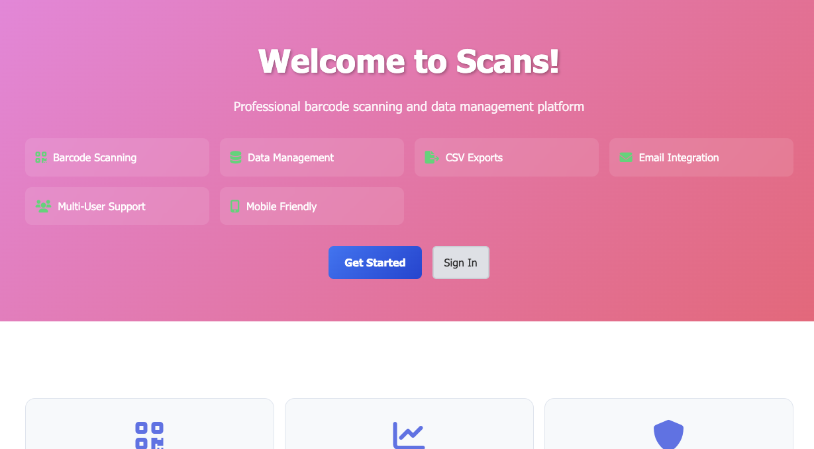

# Scans App

A **contract-built warehouse barcode scanning and data management platform** designed for speed, reliability, and simplicity on real warehouse floors.

---

## 📖 Story of the Build

A friend introduced me to a warehouse manager who needed a lightweight tool to **scan barcodes, capture structured data, and export it to CSV/email**—with **user tracking** and **basic analytics**. Their current system couldn’t support that workflow without heavy integration and delays.

Because **Wi-Fi is spotty** in many warehouse zones and workers scan **hundreds of items per shift**, every second matters. A heavy frontend framework or multiple round-trips per scan would slow them down. I built a **fast EJS/HTML-based web app** that renders server-side and ships minimal JS so pages load instantly and scans post **sub-second** in typical conditions. Hosting is deliberately humble—**a $5 Linode**—to keep ops simple and costs low.

---

## 🔑 What It Does (Core Capabilities)

- 🔍 **Lightning-fast barcode scanning**
  - Works with **keyboard wedge** and **dedicated physical scanners**
  - Minimal payloads + server-rendered pages for rapid interactions

- 🧱 **Multi-form data capture**
  - Configurable **form types** (e.g., INBOUND / OUTBOUND / RETURNS / AUDIT / PICKLIST)
  - Stores full scan payloads for traceability

- 📤 **Exports & Email**
  - **CSV exports** on demand or by time window
  - **Email exports** via **Resend** with status tracking on each run

- 📈 **Analytics**
  - Daily/weekly scan counts
  - Scans by form type / user
  - Export history and basic performance trends

- 👥 **User & Account Management (RBAC)**
  - **Admin**: manage users, exports, analytics
  - **Worker**: focused scan UI with minimal distractions
  - Multi-tenant isolation by **account**

---

## 📸 Preview

---

## 🧪 Real-World Usage (Contract Context)

- **12 daily users**
- **Hundreds of scans/day**
- **Thousands of emails sent** (exports & operational notifications)
- Hosted on a **$5/month Linode**
- **$15/month MRR after expenses** (support + hosting margin)

> The goal wasn’t a “big system,” it was a **fast, dependable tool** the team could actually use under real constraints (limited bandwidth, rugged devices, and time pressure).

---

## 🧠 Why It’s Fast

- **Server-rendered EJS** (no heavy SPA shell)
- **Tiny JS footprint** for the scan form
- **Optimized routes**: one POST per scan, lean validation, and immediate persistence
- **Aggressive caching** for static assets; **WAL mode** for SQLite for concurrent reads/writes
- **Form-specific shortcuts** to reduce keystrokes when scanning hundreds in sequence

---

## 🧰 Tech Stack

- **Backend**: Node.js, Express
- **Views**: EJS + **EJS Layouts**
- **Frontend**: HTML, CSS, vanilla JS
- **Email**: Resend
- **Charts**: Chart.js
- **Database**: SQLite (WAL), better-sqlite3
- **Auth**: Session-based with bcrypt hashing
- **Hosting**: Linode (1 vCPU/$5 plan)

---

## 👮 Roles & Permissions (RBAC)

- **Admin**
  - Create/manage users (admin/worker)
  - Trigger **CSV/email exports**
  - View **analytics dashboard**
- **Worker**
  - **Scan UI** only—fast entry, minimal clicks
  - Limited visibility to reduce clutter and errors

---

## 📊 Analytics & Reporting

- **Volume metrics**: total scans, scans/day, scans per user
- **Form distribution**: inbound vs outbound vs returns, etc.
- **Export history**: count, status, size, recipients
- **Operational health**: basic trend lines to spot spikes and slowdowns

---

## 🧩 Challenges & How They Were Solved

- **Spotty Wi-Fi in the warehouse**
  - Chose **server-rendered EJS** and minimal JS for ultra-fast loads
  - Kept requests small; single POST per scan with immediate feedback

- **High scan throughput**
  - Sub-second scan processing path
  - Avoided blocking operations; tuned SQLite with **WAL** and proper indices

- **Simple but safe auth**
  - Session-based auth with **bcrypt** hashing
  - **Role-based access** to keep workers focused and reduce mis-clicks

- **Low operational budget**
  - Single **$5 Linode** node
  - SQLite with WAL (no external DB to manage)
  - Emails via **Resend** for reliability and easy observability

---

## 🧮 What It Can Handle

- **Hundreds of scans per day** (sustained)
- **Thousands of emails sent** (exports/notifications over time)
- **12 daily users** across **admin/worker** roles
- Continuous CSV exports without blocking scanning

---

## 🔒 Security Notes

- Passwords hashed with **bcrypt**
- Session-based authentication, secure cookies
- Multi-tenant account isolation
- Input validation/sanitization on all scan/Export routes

---

## 🧾 Business Snapshot

- **Hosting**: $5/month Linode
- **MRR**: ~$15/month **after expenses**
- Ongoing support/maintenance under a **contract arrangement**

---

## 🗺️ TL;DR

The **Scans App** is a **contract-built tool** for warehouse teams who need speed and reliability over bells and whistles. It **handles real volume**, stays fast in **low-bandwidth** environments, and gives admins the **exports and analytics** they need—without a heavyweight stack.

---
